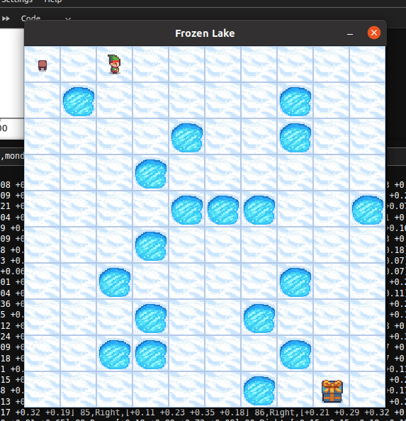

# Apprentissage-Par-Renforcement

## Projet DQN pour FrozenLake et MiniGrid

Ce projet implémente des agents d'apprentissage par renforcement basés sur Deep Q-Networks (DQN) pour deux environnements : FrozenLake et MiniGrid. Chaque agent utilise une architecture DQN, mais les environnements diffèrent dans la manière dont l'agent perçoit son état.

## Environnements

### FrozenLake

    

Dans l'environnement FrozenLake, l'agent connaît l'intégralité de l'environnement. Cet agent apprend à naviguer sur un lac gelé, en évitant les trous et en atteignant la case de but.

**Caractéristiques :**
- L'état de l'environnement est entièrement observable.
- L'agent prend des décisions basées sur des valeurs Q pour chaque action possible.

### MiniGrid

Dans l'environnement MiniGrid, l'agent ne connaît que ce qu'il peut voir devant lui. Cet agent apprend à naviguer dans un monde en grille, où les murs, les portes, et les objets peuvent limiter sa visibilité.

**Caractéristiques :**
- L'état de l'environnement est partiellement observable.
- L'agent utilise une stratégie epsilon-greedy pour choisir ses actions, favorisant l'exploration au début et l'exploitation au fil du temps.
